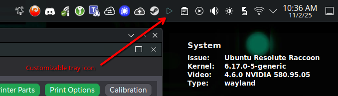
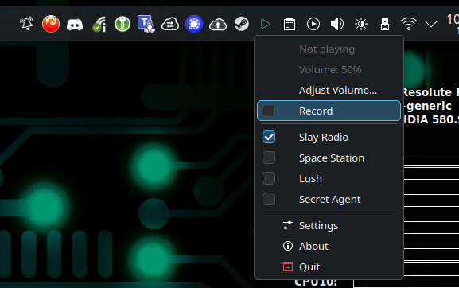
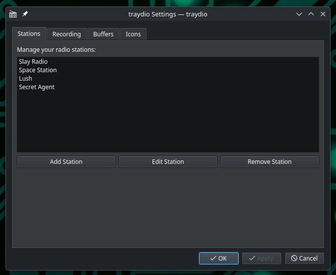

# Traydio

A lightweight internet radio player for Linux (KDE Plasma 6 friendly) that lives in your system tray. It plays online radio streams, shows now‑playing notifications, and can record streams to files with smart, RAM‑cached track splitting.

## Highlights

- System tray app with volume control and station picker
- Now‑playing notifications with artist/title
- Recording mode with RAM caching (encoded bytes)
  - Writes the previous track when the next one starts
  - Non‑WAV formats split into parts when cache exceeds your limit (e.g. `-1`, `-2`, …)
  - WAV never splits mid‑track; it warns at 95% of your limit and auto‑stops
  - Filename collisions add a timestamp suffix like `_YYMMDDHHMMSS`
  - MP3 parts get minimal ID3v2.3 tags (artist, title, date)
- Settings UI stored in `~/.config/traydio/config.json`

## Screenshots







## Requirements

- Linux (tested with Wayland)
- Python 3.10+
- Python packages:
  - PyQt6
  - PyGObject (GObject introspection for GStreamer bindings)
  - mutagen (for MP3 part tagging)
- System packages (GStreamer runtime and plugins):
  - GStreamer 1.x core and plugin sets (base/good/bad/ugly, libav as available)

> Note: GStreamer itself and its plugins are installed via your Linux package manager. Python packages are installed via `pip`.

## Install (Python deps)

Create a virtual environment (recommended) and install Python requirements:

```bash
python3 -m venv .venv
source .venv/bin/activate
pip install -U pip wheel
pip install -r requirements.txt
```

If PyGObject fails to build from `pip` on your distro, install your distro's `python3-gi` package and optionally remove the `PyGObject` line from `requirements.txt` before running `pip install -r requirements.txt` again.

## Install (System deps)

Below are quick commands for common Linux packaging systems.

### Debian/Ubuntu (apt)

```bash
sudo apt update
# Core Python bits (if needed)
sudo apt install -y python3 python3-pip
# GStreamer runtime + plugins
sudo apt install -y \
  gstreamer1.0-tools \
  gstreamer1.0-plugins-base \
  gstreamer1.0-plugins-good \
  gstreamer1.0-plugins-bad \
  gstreamer1.0-plugins-ugly \
  gstreamer1.0-libav
# Recommended: use distro PyGObject if pip build fails
sudo apt install -y python3-gi gir1.2-gstreamer-1.0
```

If you want to build PyGObject from pip (not usually necessary), you may need headers:

```bash
sudo apt install -y libgirepository1.0-dev libglib2.0-dev libcairo2-dev pkg-config
```

### Fedora (dnf)

```bash
sudo dnf install -y python3 python3-pip
sudo dnf install -y \
  gstreamer1 \
  gstreamer1-plugins-base \
  gstreamer1-plugins-good \
  gstreamer1-plugins-bad-free \
  gstreamer1-plugins-ugly-free \
  gstreamer1-libav
# Recommended: use distro PyGObject if pip build fails
sudo dnf install -y python3-gobject gobject-introspection
```

## Run

From the repository root:

```bash
# Using the main module
python main.py

# Or as a package module
python -m traydio
```

The app will place an icon in your system tray.

## Recording behavior

- Enable “Record” from the tray menu.
- The app caches the current track (encoded bytes) in RAM and writes it to disk when the next track starts.
- If the cache grows beyond your configured limit:
  - Non‑WAV formats: the current audio is written out as a part (`-1`, `-2`, …) and caching continues.
  - WAV: the app warns at 95% of the limit and auto‑stops recording (no partial WAVs on disk).
- File naming:
  - Base: `Artist - Title` (or `Title` if artist missing). Fallback: `Station - YYYY-MM-DD HH-MM-SS`.
  - Parts: `Name - N.ext`.
  - On collision: `Name - N_YYMMDDHHMMSS.ext`.
- Manual stop renames the just‑flushed file to include `- partial`.

You can adjust the RAM cache limit and notification durations in Settings → Recording Options.

## Configuration

- Config file: `~/.config/traydio/config.json`
- Default recording directory: `~/Music`
- Change stations, recording format, RAM cache limit, and buffer settings from the Settings dialog.

## Tray icons

You can customize the icons shown in the system tray:

- Playing Icon (.png)
- Paused/Stopped Icon (.png)

Notes

- Paused and stopped share the same UI state; there isn’t a separate pause icon in the app logic.
- Only PNG files are supported. When you pick an icon in Settings, the app will use that file path directly (it is not copied). If you later move or delete the file, the app will fall back to the theme icon.
- To revert to theme icons, clear the path(s) in Settings → Tray Icons and press “Reset to Default.”

Upgrade/migration

- If you used an older version that had a distinct “Paused Icon,” the app will automatically migrate that value to the Paused/Stopped icon on first load and remove the legacy key from your config file the next time it’s saved.

## Troubleshooting

- No audio or recording fails: verify GStreamer core and plugin sets are installed.
- PyGObject build issues: install `python3-gi` via your package manager and remove `PyGObject` from `requirements.txt` before running `pip install -r requirements.txt`.
- No tray icon: ensure your desktop environment shows legacy tray icons and that traydio is allowed to display notifications.

## License

MIT (see repository license if present).
